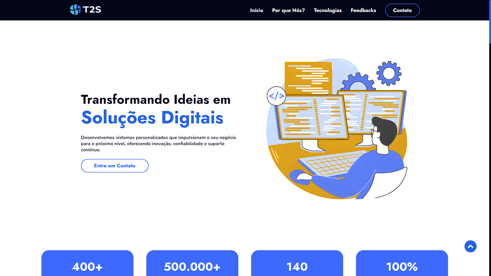

# Readme.Github

# **Landing Page T2S - Desafio de Estágio**

## 📱Descrição do projeto

### A Landing Page T2S é um projeto desenvolvido como parte do desafio para a vaga de estágio na T2S. O objetivo da página é promover um serviço específico oferecido pela empresa, destacando seus benefícios e incentivando os visitantes a contratarem o serviço. A Landing Page desenvolvida deve ter um formulário de registro de leads e botões de chamada para ação (Call To Action).

## **💼 Serviço da T2S Escolhido**

O serviço escolhido para o desenvolvimento desta Landing Page foi “Desenvolvimento de Sistemas”.

## 🔨Funcionalidades da aplicação web - RFs

- `Funcionalidade 1`: Formulário de registro de LEADS.
- `Funcionalidade 2`: Carrossel com os depoimentos dos clientes na seção de feedbacks.
- `Funcionalidade 3`: Filtro das tecnologias usadas pela empresa T2S na seção de tecnologies. é possível filtrar por “Linguages”, “Banco de Dados”, “Frameworks” e “Cloud Providers”.

## ✔️Tecnologias utilizadas

- `HTML`
- `CSS`
- `JavaScript`

## 
📱Interface

## Gostaria de dar uma olhada na Landing Page? Clique no link abaixo:

### https://desenvolvimentodesistemas-t2s.netlify.app/